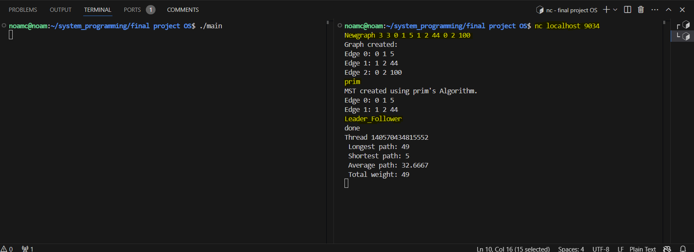
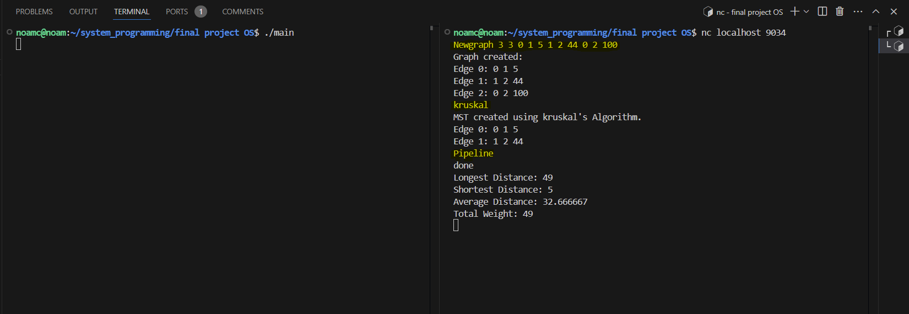

# Trheds and MST requests server

## Description

In this project to build a server of the MST requests in addition
We were required to realize 2 design patterns
1.Leader Follower
2.Pipeline

## running 
How to runnig?
1.write `make`.
2.write `./main` - Server starts working
4.open additional terminal work with Netcat program with the command `nc localhost 9034` for connect.

after that you can use with the following commands(in clients) :

1.`Newgraph n m <edge1> ... <edgeM> `  - Creating a graph
`n` means number of vertex.
`m` means number of edges.

what is `edge`?  `from` `to` `weghit`

for example :`edge` = 0 1 10 means that there is an edge between vertex 0 to vertex 1 in a weight of 10
after that the graph printed as list of edges.

2.`Newedge u v w` - add edge between u and v in a weight of w after that prined if sucsses .

3.`Removeedge u v` - remove edge between u and v after that prined if sucsses .

4.`prim` or `kruskal` - Choose an algorithm and printed the MST (Minimum spanning tree).

5.`Pipeline` or `Leader_Follower` - Choose a design pattern

Example of a run prim and Leader Follower:

Example of a run kruskal and Pipeline:

